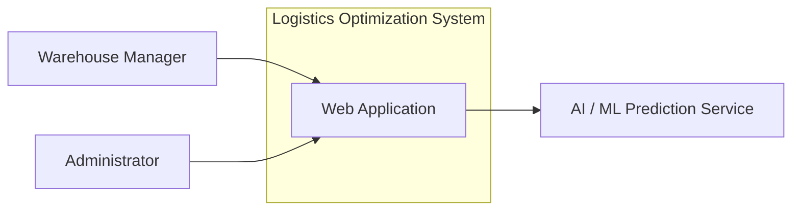
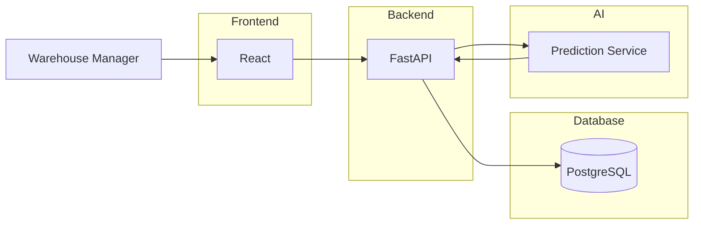
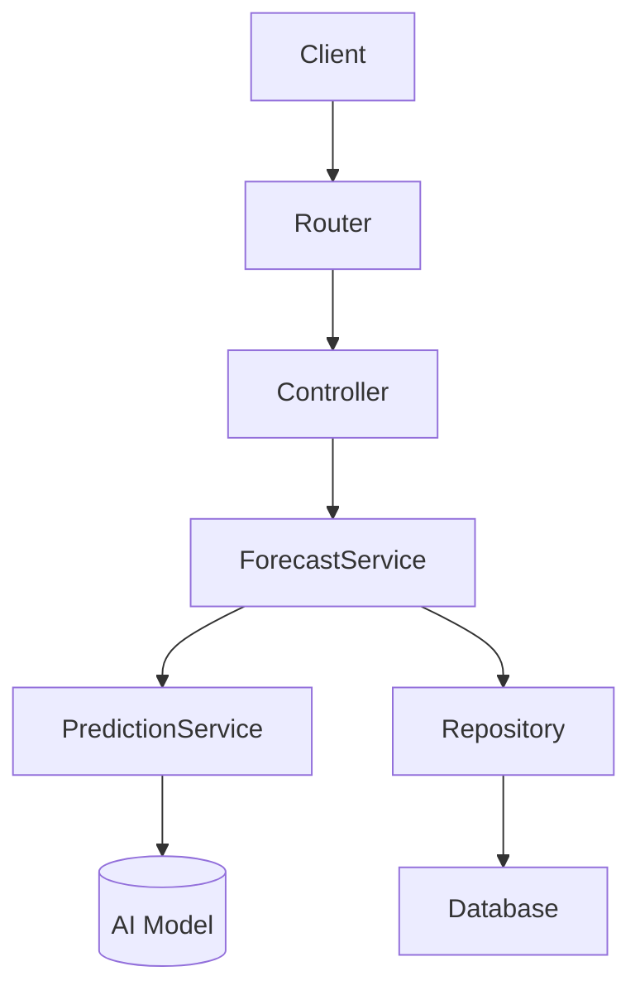

# Software Architecture - C4 Model

## System Context

### Actors

| Actor | Responsibility |
|-------|----------------|
| Warehouse Manager | Upload sales data, request demand forecasting, optimize warehouse allocation, view optimization results |
| Administrator | Manage system data, monitor dashboards, manage users and datasets |

---

### System Boundary

The Logistics Optimization System assists fresh-food subscription startups in making procurement and inventory planning decisions. It provides demand forecasting, warehouse optimization, supplier recommendations, and operational dashboards while integrating with an AI/ML optimization service.

---

### External Systems

| External System | Purpose |
|----------------|---------|
| AI/ML Prediction Service | Generate demand forecasts and optimization recommendations (simulated during MVP) |

---

### Context Diagram

---

### Description

The Warehouse Manager and Administrator interact with the Logistics Optimization System through a web application.

The system manages inventory information, historical sales, supplier information, and forecasting requests.

When a forecast or optimization is requested, the system sends the necessary data to an AI/ML Prediction Service. During the MVP stage, this service is simulated. Later, it will be replaced with the real machine learning or quantum optimization model without changing the system architecture.

---

# Container

| Container | Technology | Responsibility |
|-----------|------------|----------------|
| Frontend | React | User interface for warehouse managers and administrators |
| Backend API | FastAPI | REST API, business logic, authentication, workflow orchestration |
| Database | PostgreSQL | Store sales history, inventory, suppliers, forecasts and users |
| Prediction Service | Python (placeholder) | Generate demand forecasts and optimization results |

---

## Container Diagram

---

### Description

The Frontend communicates with the Backend through REST APIs.

The Backend is responsible for:

- validating requests
- executing business logic
- reading and writing data
- communicating with the Prediction Service

The Database stores operational data including inventory, suppliers, historical sales, and forecast results.

The Prediction Service receives processed sales data from the Backend and returns demand forecasts or optimization recommendations. During development this service returns simulated results and will later be replaced with the real AI/ML or quantum optimization model.

---

# Component

| Component | Responsibility |
|-----------|----------------|
| Router | Define REST API endpoints |
| Controller | Receive HTTP requests and validate input |
| Forecast Service | Execute business logic for forecasting workflows |
| Prediction Service | Call AI/ML model through a common interface |
| Repository | Read and write data from the database |

---

## Component Diagram

---

### Description

The Router exposes REST API endpoints.

The Controller validates incoming requests and forwards them to the appropriate service.

The Forecast Service contains the application's business logic and coordinates database access and prediction requests.

The Repository abstracts database operations from the business logic.

The Prediction Service defines a common interface for generating forecasts. Initially it uses a simulated implementation. Later it can be replaced by machine learning or quantum optimization algorithms without affecting the frontend or API layer.

---

# Code

## Notes

The Code level of the C4 Model is intentionally omitted because the implementation source code serves as the primary documentation.
