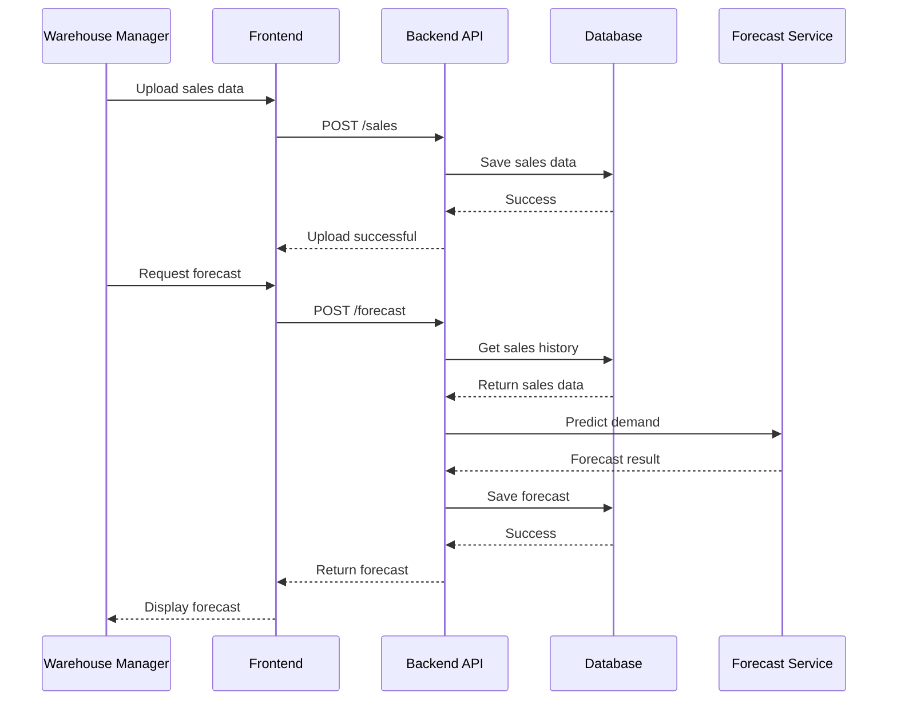
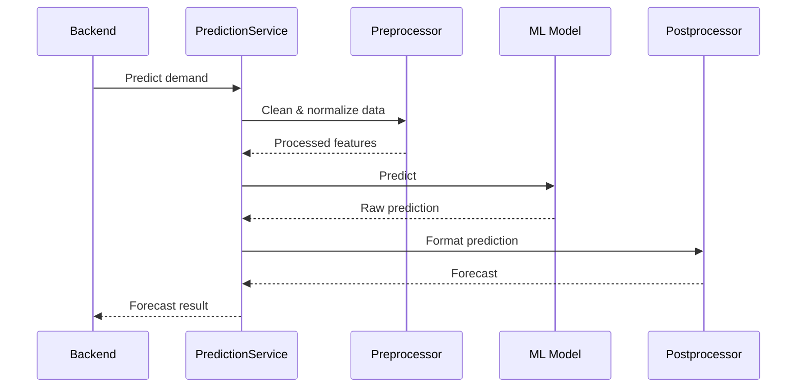

# Sequence Diagrams

## 1. Upload Sales Data and Request Forecast

```mermaid

sequenceDiagram
    participant WM as Warehouse Manager
    participant FE as Frontend
    participant BE as Backend API
    participant DB as Database
    participant Model as Forecast Service

    WM->>FE: Upload sales data

    FE->>BE: POST /sales

    BE->>DB: Save sales data

    DB-->>BE: Success

    BE-->>FE: Upload successful

    WM->>FE: Request forecast

    FE->>BE: POST /forecast

    BE->>DB: Get sales history

    DB-->>BE: Return sales data

    BE->>Model: Predict demand

    Model-->>BE: Forecast result

    BE->>DB: Save forecast

    DB-->>BE: Success

    BE-->>FE: Return forecast

    FE-->>WM: Display forecast

```

## 2. Forecast Sevices

``` mermaid

sequenceDiagram
    participant BE as Backend
    participant PS as PredictionService
    participant Pre as Preprocessor
    participant Model as ML Model
    participant Post as Postprocessor

    BE->>PS: Predict demand

    PS->>Pre: Clean & normalize data

    Pre-->>PS: Processed features

    PS->>Model: Predict

    Model-->>PS: Raw prediction

    PS->>Post: Format prediction

    Post-->>PS: Forecast

    PS-->>BE: Forecast result
```
