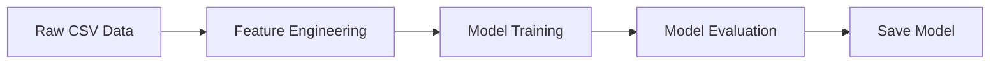
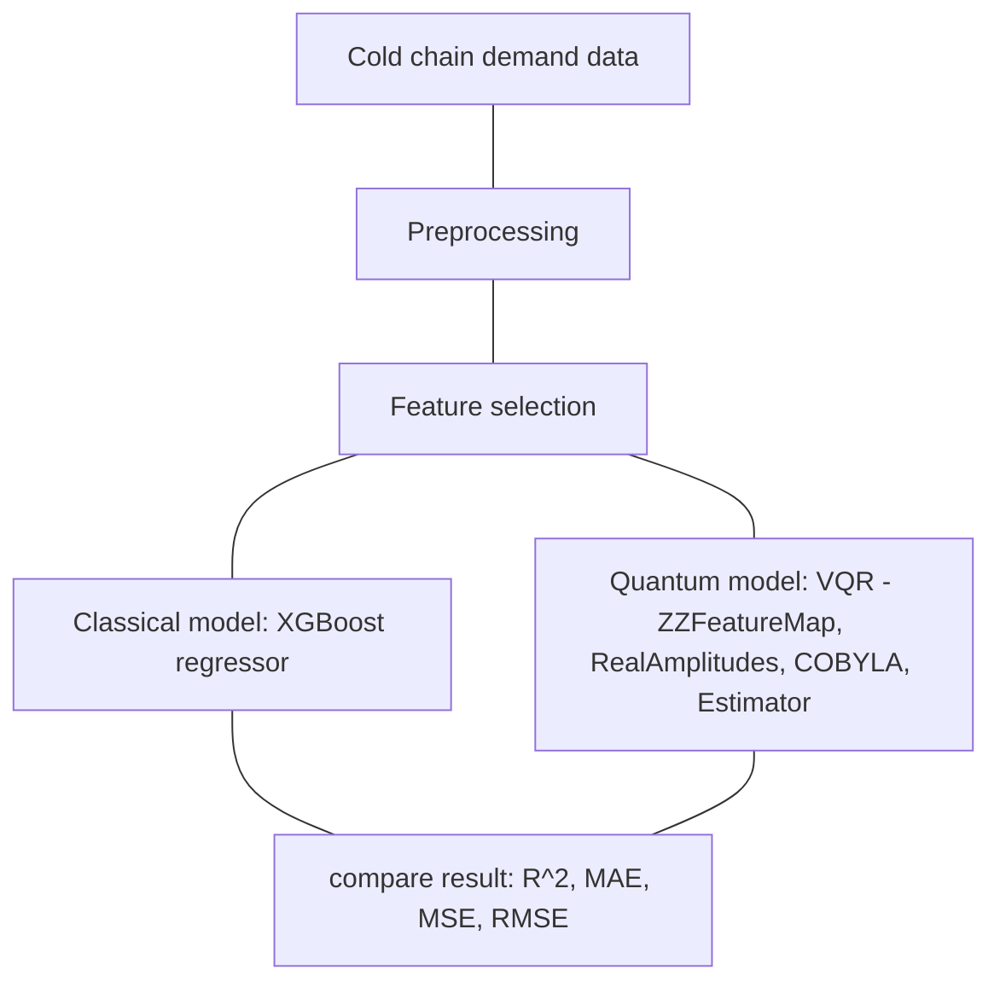

# QML Model - Training Workflow

## Workflow Diagram

---

## Raw Data Collection

### Dataset

* **Dataset:** [FRESHRETAILNET-50k](https://huggingface.co/datasets/Dingdong-Inc/FreshRetailNet-50K)
* **Format:** CSV

#### Overview

FreshRetailNet-50K is the first large-scale benchmark for censored demand estimation in the fresh retail domain, incorporating approximately 20% organically occurring stockout data. It comprises 50,000 store-product 90-day time series of detailed hourly sales data from 898 stores in 18 major cities, encompassing 865 perishable SKUs with meticulous stockout event annotations. The hourly stock status records unique to this dataset, combined with rich contextual covariates including promotional discounts, precipitation, and other temporal features, enable innovative research beyond existing solutions.

* Publicly available dataset
* License: **Creative Commons Attribution 4.0 International (CC BY 4.0)**

#### License Compliance

This project uses the dataset in accordance with the CC BY 4.0 license.

The license permits:

* Sharing and redistribution.
* Modification and adaptation.
* Commercial and non-commercial use.

To comply with the license requirements, this project:

* Provides appropriate attribution to the original dataset.
* Includes a reference to the original dataset source.
* Documents any preprocessing or modifications performed on the data.

## FreshRetailNet-50K

### Feature

# API Specification

| Field | Type | Description
|--------|----------|---------
|city_id | int64 | The encoded city id
|store_id | int64 | The encoded store id
|management_group_id | int64 | The encoded management group id
|first_category_id | int64 | The encoded first category id
|second_category_id | int64 | The encoded second category id
|third_category_id | int64 | The encoded third category id
|product_id | int64 | The encoded product id
|dt | string | The date
|sale_amount | float64 | The daily sales amount after global normalization (Multiplied by a specific coefficient)
|hours_sale | Sequence(float64) | The hourly sales amount after global normalization (Multiplied by a specific coefficient)
|stock_hour6_22_cnt | int32 | The number of out-of-stock hours between 6:00 and 22:00
|hours_stock_status | Sequence(int32) | The hourly out-of-stock status
|discount | float64 | The discount rate (1.0 means no discount, 0.9 means 10% off)
|holiday_flag | int32 | Holiday indicator
|activity_flag | int32 | Activity indicator
|precpt | float64 | The total precipitation
|avg_temperature | float64 | The average temperature
|avg_humidity | float64 | The average humidity
|avg_wind_level | float64 | The average wind force

---

## Feature Engineering

### Derived features

- sale_amount
- stock_hour6_22_cnt
- discount
- holiday_flag
- activity_flag
- precpt
- avg_temperature
- avg_humidity
- avg_wind_level
- day_sin
- day_cos
- day_sin_month
- day_cos_month
- month_sin
- month_cos
- stockout_hours
- stockout_ratio
- longest_stockout
- first_stockout_hour
- last_stockout_hour
- business_stockout
- discount_stockout_ratio
- discount_stock_hour6_22_cnt
- discount_business_stockout
- holiday_stockout_ratio
- activity_stockout_ratio
- bad_weather
- is_weekend
### Feature scaling for the quantum model

## Model Training

Two branches are trained in parallel on the same cleaned, feature-selected data so results are directly comparable.

### Classical baseline: XGBoost

* **Model:** `XGBRegressor`
* **Target:** `sale_amount` forecast at a 30-90 day horizon
* **Hyperparameters:** tuned via grid search / random search over `max_depth`, `n_estimators`, `learning_rate`
* **Input:** top-k selected features per run

### Quantum model: Variational Quantum Regressor (VQR)

* **Framework:** Qiskit
* **Feature map:** `ZZFeatureMap` — encodes classical features as quantum states
* **Ansatz:** `RealAmplitudes` — parameterized circuit that is trained
* **Optimizer:** `COBYLA` — classical optimizer that updates circuit parameters
* **Estimator:** `StatevectorEstimator` — computes expectation values used as the model's prediction
* **Input:** same top-k selected features as the XGBoost run, scaled to the quantum-compatible range

Both models are trained once per value of `k` in the sweep (`k = 4, 8, 12, 16, 20, 24, 27`), producing a matched set of results for direct comparison at each feature-count level.

---

## Model Evaluation

### Metrics

* **MAPE** (Mean Absolute Percentage Error) — primary metric, easy to explain to non-technical stakeholders
* **RMSE** (Root Mean Squared Error) — secondary metric, penalizes larger errors more heavily

### Comparison table (fill in with actual run results)

| k (features) | XGBoost MAPE | XGBoost RMSE | VQR MAPE | VQR RMSE | Notes |
|---|---|---|---|---|---|
| 4 | | | | | |
| 8 | | | | | |
| 12 | | | | | |
| 16 | | | | | |
| 20 | | | | | |
| 24 | | | | | |
| 27 | | | | | |

### What to look for

* Does VQR error decrease, stay flat, or increase as `k` grows? (More qubits does not always mean better results — barren plateaus and optimizer difficulty can appear at higher `k`.)
* At which `k`, if any, does VQR match or beat XGBoost?
* Is VQR relatively more competitive on noisier or higher-uncertainty SKUs (e.g. products with frequent stockouts) than on stable-demand SKUs? This ties back to published research showing quantum circuits can be competitive under higher noise conditions.

---

## Save Model

* **XGBoost model:** saved as a `.json` or `.pkl` file via `model.save_model()` / `joblib.dump()`.
* **VQR model:** save the trained circuit parameters (weights from `RealAmplitudes`) as a `.npy` or `.json` file, along with the feature map configuration and the scaler used for input normalization, so the exact same preprocessing can be reproduced at inference time.
* **Versioning:** each saved model is tagged with the `k` value it was trained on and the dataset version, so results stay traceable back to a specific run.
