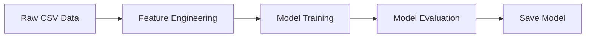

# QML Model - Training Workflow

## Workflow Diagram

---

## Raw Data Collection

### Dataset

* **Dataset:** [FRESHRETAILNET-50k](https://huggingface.co/datasets/Dingdong-Inc/FreshRetailNet-50K)
* **Format:** CSV
#### Overview

FreshRetailNet-50K is the first large-scale benchmark for censored demand estimation in the fresh retail domain, incorporating approximately 20% organically occurring stockout data. It comprises 50,000 store-product 90-day time series of detailed hourly sales data from 898 stores in 18 major cities, encompassing 865 perishable SKUs with meticulous stockout event annotations. The hourly stock status records unique to this dataset, combined with rich contextual covariates including promotional discounts, precipitation, and other temporal features, enable innovative research beyond existing solutions.

* Publicly available dataset
* License: **Creative Commons Attribution 4.0 International (CC BY 4.0)**

#### License Compliance

This project uses the dataset in accordance with the CC BY 4.0 license.

The license permits:

* Sharing and redistribution.
* Modification and adaptation.
* Commercial and non-commercial use.

To comply with the license requirements, this project:

* Provides appropriate attribution to the original dataset.
* Includes a reference to the original dataset source.
* Documents any preprocessing or modifications performed on the data.

## FreshRetailNet-50K

### Feature

# API Specification

| Field | Type | Description
|--------|----------|---------
|city_id | int64 | The encoded city id
|store_id | int64 | The encoded store id
|management_group_id | int64 | The encoded management group id
|first_category_id | int64 | The encoded first category id
|second_category_id | int64 | The encoded second category id
|third_category_id | int64 | The encoded third category id
|product_id | int64 | The encoded product id
|dt | string | The date
|sale_amount | float64 | The daily sales amount after global normalization (Multiplied by a specific coefficient)
|hours_sale | Sequence(float64) | The hourly sales amount after global normalization (Multiplied by a specific coefficient)
|stock_hour6_22_cnt | int32 | The number of out-of-stock hours between 6:00 and 22:00
|hours_stock_status | Sequence(int32) | The hourly out-of-stock status
|discount | float64 | The discount rate (1.0 means no discount, 0.9 means 10% off)
|holiday_flag | int32 | Holiday indicator
|activity_flag | int32 | Activity indicator
|precpt | float64 | The total precipitation
|avg_temperature | float64 | The average temperature
|avg_humidity | float64 | The average humidity
|avg_wind_level | float64 | The average wind force
